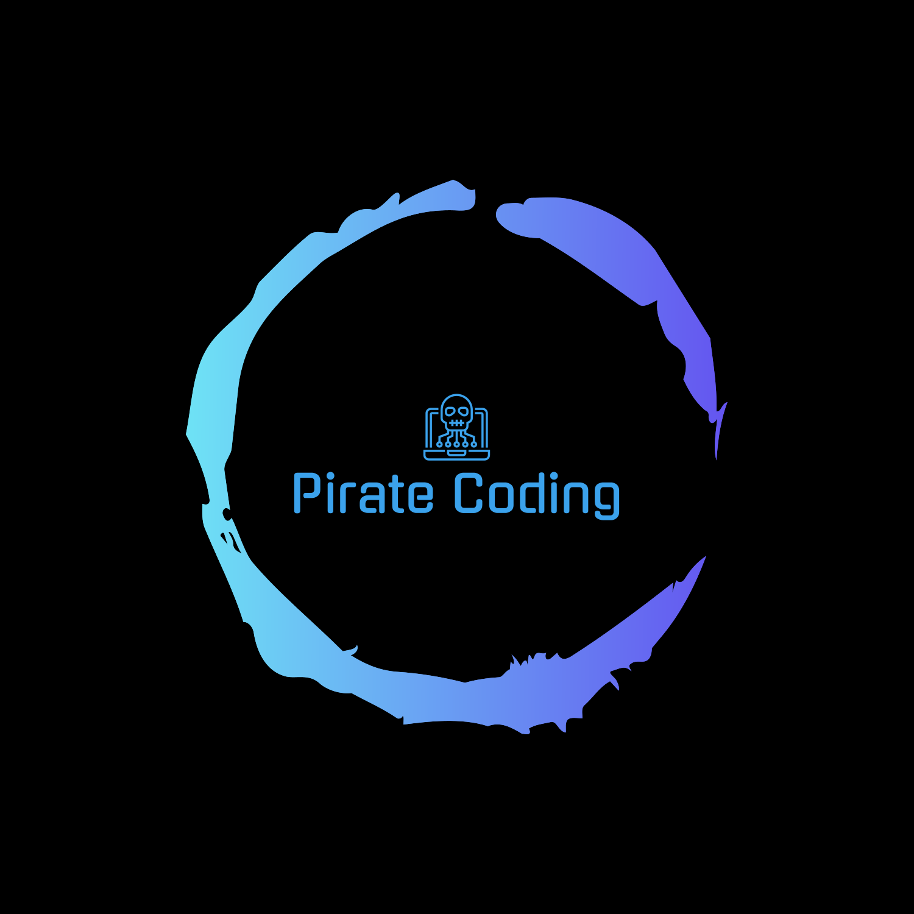

<div align='center'>

<h1>MindCanvas</h1>
<p>Image generator —where creativity meets AI!</p>

<h4> <a href=https://marvelous-moonbeam-1db950.netlify.app/>View Demo</a> <span> · </span> <a href="https://github.com/ksoni15/MindCanvas/blob/main/README.md"> Documentation </a> <span> · </span> <a href="https://github.com/ksoni15/MindCanvas/blob/main/README.md"> Report Bug </a> <span> · </span> <a href="https://github.com/ksoni15/MindCanvas/blob/main/README.md"> Request Feature </a> </h4>


</div>

# :notebook_with_decorative_cover: Table of Contents

- [About the Project](#star2-about-the-project)
- [Acknowledgements](#gem-acknowledgements)


## :star2: About the Project

### :camera: Screenshots
<div align="center"> <a href="https://marvelous-moonbeam-1db950.netlify.app/"></a> </div>


### :dart: Features
- Generate AI Image
- Share AI Image
- Download shared AI Image
- Search shared AI Image


## :toolbox: Getting Started

### :gear: Installation

npm install
```bash
npm install
```


### :running: Run Locally

Clone the project

```bash
https://github.com/ksoni15/MindCanvas
```
Client side
```bash
npm run dev
```
Server side (Please check MongoDB connected)
```bash
npm start
```


### :triangular_flag_on_post: Deployment

Client side npm build
```bash
npm run build
```


## :gem: Acknowledgements

Use this section to mention useful resources and libraries that you have used in your projects.

- [tailwind css ](https://tailwindcss.com/)
- [vite js](https://vitejs.dev/)
